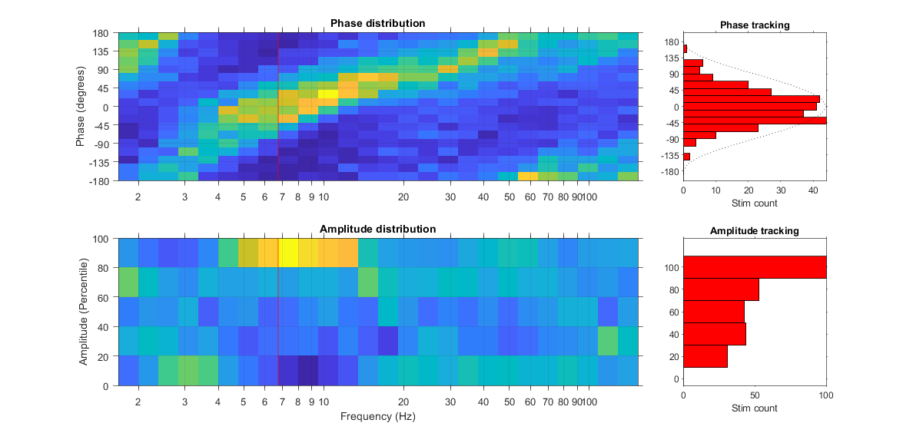
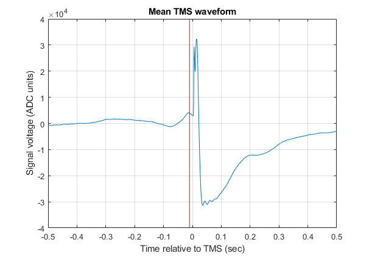

# Closed-loop EEG/TMS system code

This repository contains code for running and analyzing a closed-loop EEG/TMS system based on a National Instruments FPGA (field programmable gate array) device.

## Installation instructions

To run the MATLAB code that analyzes the performance of system: 
1. Place the files found in the MATLAB directory into a folder in your MATLAB environment path.
2. Install the [circstat toolbox](https://www.mathworks.com/matlabcentral/fileexchange/10676-circular-statistics-toolbox-directional-statistics) for MATLAB.

## Output of ClosedLoopPerf.m

The function `ClosedLoopPerf` takes an `.lvm` file returned by the closed loop system and analyzes the phase and amplitude dependence of TMS triggering across multiple frequency bands. Note that causal filters are used to isolate each frequency band, and phase and amplitude extracted using a Hilbert transform. This seems to introduce some contamination from the TMS pulse if one samples exactly at the trigger time, so an offset is used (default 10 samples, 10 ms at 1kHz sample rate) to mitigate this.

To determine which frequency band was trigged upon with the greatest specificity, we measure the [Kullback-Leibler (KL) divergence](https://en.wikipedia.org/wiki/Kullback%E2%80%93Leibler_divergence) of trigger probabilities across a band's phase and amplitude with respect to a uniform distribution (null hypothesis). The frequency band with the largest KL divergence is deemed the best and further analyzed for quantifying the precision and accuracy of the closed-loop system. 

In addition to returning performance metrics (which are detailed in the code comments), it also displays two figures that help judge spectral features driving triggering. The first is the 'Performance' window:

The top left plot shows trigger counts as a function of frequency and phase. A slightly diagonal yellow band restricted to a particular range of frequencies indicates phase specific triggering that is frequency specific. The top right panel is the distribution of the phases triggered upon at the best frequency. Red bars denote the distribution, and the black dotted line is a reference wave. In this case, triggering happened at the peak of the wave. The bottom right plot shows trigger counts as a function of frequency and amplitude. Since the closed-loop system has an amplitude threshold for triggering, the frequency that is targeted should show more triggers at higher amplitudes, compared with frequencies that were not being tracked. The yellow band of increased triggering above the 80th amplitude percentile and between 4 to 12 Hz demonstrates this. To the right of that plot is the distribution of amplitude triggers at the best frequency. The red vertical line on both left side plots denotes the best frequency according to the KL divergence.

The other plot generated is the mean TMS waveform, which provides another way to assess the specificity of triggering.

Here we see that the TMS produced a large artifact. But, immediately prior we see a half cycle of a EEG wave that has a duration of ~60 ms. The full wave would thus be 120 ms, which is near 8 Hz, the theta frequency that was targeted. You can also see that the TMS pulse happens shortly after the peak of the wave, consistent with phase targeting of the theta rhythm phase peak. The vertical red line denotes the offset from the TMS pulse where EEG phase and amplitude were measured.
